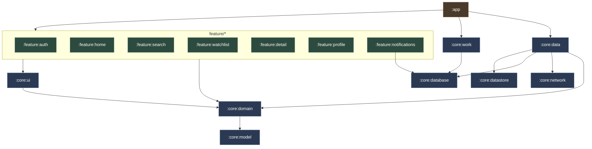
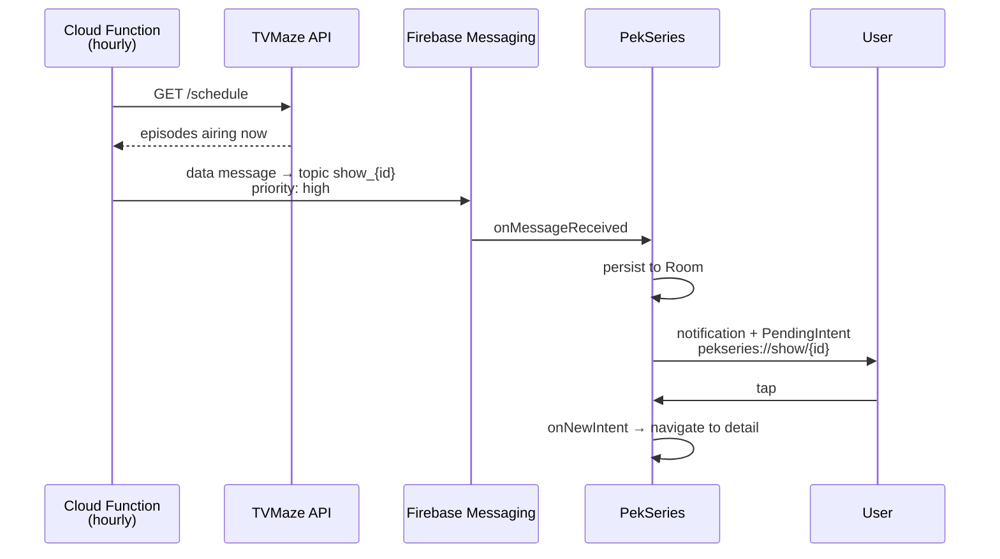

# Architecture

PekSeries is a multi-module Clean Architecture app. This document explains the
module graph, the rules that keep it from rotting, and why several decisions
were made the way they were.

## Module graph

Dependencies point in one direction only: `app` → `feature` → `core:domain` ← `core:data`.



### What each module is for

| Module | Responsibility |
|---|---|
| `:app` | Shell only: `Application`, `MainActivity`, navigation graph. Supplies the Hilt bindings that satisfy the domain interfaces. |
| `:core:model` | Plain data classes. No Android, no framework. |
| `:core:domain` | Repository **interfaces**, use cases, `PekResult`, `DataError`, validation. The contract layer. |
| `:core:data` | Implementations of those interfaces. The only module that knows about Retrofit, Firestore and Room together. |
| `:core:network` | Retrofit service definitions and wire DTOs. Nothing else. |
| `:core:database` | Room database, entities, DAOs. |
| `:core:datastore` | Typed user preferences over DataStore. |
| `:core:ui` | Theme plus shared Composables (`PekLoadingView`, `PekErrorView`, `PekEmptyView`). |
| `:core:work` | FCM service and the deep-link contract. |
| `:core:testing` | Fakes, test data and `MainDispatcherRule`, shared by every test. |
| `:feature:*` | One screen each: Composable + ViewModel. Depends on `:core:domain`, never on `:core:data`. |

## The rules

**1. Features depend on interfaces, never implementations.**
A feature module declares `implementation(projects.core.domain)`. It cannot see
Retrofit or Firestore, which is what makes every ViewModel testable with a fake
and no Firebase runtime.

**2. `core` never depends on `feature`.**
This was violated until 1.9.0 — `:core:work` depended on `:feature:notifications`
just to reach `NotificationDao`, so a core module could not be built without a
feature module. Room moved into `:core:database` to fix it.

**3. Repositories return `PekResult`, they do not throw and they do not swallow.**
This is the most important rule in the codebase.

## Error handling

Before 1.10.0 every repository method looked like this:

```kotlin
suspend fun getTodayEpisodes() = try {
    ...
} catch (e: Exception) { emptyList() }
```

Three problems: the UI could not distinguish "no results" from "the network is
down" and rendered an empty list for both; `CancellationException` was swallowed,
which breaks structured concurrency; and the `Error` branch in `HomeUiState` was
unreachable dead code.

Now:

```kotlin
sealed interface PekResult<out T> {
    data class Success<out T>(val data: T) : PekResult<T>
    data class Failure(val error: DataError) : PekResult<Nothing>
}
```

`DataError` enumerates `Network`, `RateLimited`, `NotFound`, `Unauthenticated`,
`Server`, `Unknown` and a nested `Auth` hierarchy. `runCatchingData` converts
thrown exceptions into typed failures and **rethrows `CancellationException`**.

Each screen maps the result into an explicit UI state — `Loading` / `Success` /
`Empty` / `Error` — and `DataError.toUserMessage()` in `:core:ui` is the single
place that turns an error into user-facing copy.

`RateLimited` is called out because TVMaze returns 429 aggressively when
requests are not batched.

## Build logic

`build-logic` is an included build exposing convention plugins, so a module
build file states only what is genuinely specific to it:

```kotlin
plugins {
    alias(libs.plugins.pekseries.android.feature)
}

android {
    namespace = "az.pekstudios.pekseries.feature.watchlist"
}

dependencies {
    implementation(projects.core.domain)
    implementation(libs.coil.compose)
}
```

Available: `pekseries.android.{application, application.compose, library,
library.compose, feature, hilt, room, firebase}`.

> **AGP 9 note.** `CommonExtension` lost both its generics and its
> `defaultConfig { }` Action overloads. The widely-copied Now-in-Android
> signature `CommonExtension<*,*,*,*,*,*>` does **not** compile against AGP 9;
> these plugins use property access instead.

## Notifications

Delivery is entirely server-driven.



Two things to know:

**Messages are data-only.** There is no `notification` block, so FCM never
auto-displays anything and `onMessageReceived` always runs. The app builds the
notification itself. This is why `priority: "high"` matters — without it Doze
defers data messages, sometimes for hours.

**Deep links go through a URI, not a class reference.** `:core:work` cannot
reference `MainActivity` without inverting the module dependency, so it fires an
implicit `VIEW` intent at `pekseries://show/{showId}` and `:app` declares the
matching intent-filter. `MainActivity` uses `launchMode="singleTop"` plus
`onNewIntent`, so a tap while the app is running navigates rather than being
dropped. A link tapped while signed out is held and honoured after login.

Subscriptions are mirrored to FCM topics named `show_{tvMazeId}`. Topics are
per-install, not per-account, so they are re-synced after every login and the
profile toggle subscribes/unsubscribes them all.

## Two APIs

TMDB has the better catalogue and artwork; TVMaze has the episode schedule. The
app uses both, which means TMDB ids must be translated to TVMaze ids before
episodes or subscriptions are available — via IMDb id, then TVDB id, then a name
search.

> **Known cost.** `ShowRepositoryImpl.enrich()` resolves that id per show, so a
> 15-item page can mean up to 60 upstream calls. This is the main source of
> TVMaze 429s and is marked `TODO(perf)`; it wants a persisted id cache.

## Testing

`:core:testing` holds the fakes and `MainDispatcherRule`, so a module under test
declares one dependency:

```kotlin
testImplementation(projects.core.testing)
```

Hand-written fakes are preferred over mocks: the tests care about
success / empty / failure behaviour, and a fake expresses those without a
stubbing DSL in every test.

| Layer | What is covered |
|---|---|
| `:core:domain` | `PekResult` algebra, validation rules, watch-stats use case |
| `:core:data` | Exception → `DataError` mapping, DTO → domain mappers |
| `:core:database` | DAO behaviour and Flow emissions (Robolectric) |
| `:core:datastore` | Preference round-trips and clearing semantics |
| `:feature:*` | ViewModel state transitions, including every failure path |

Robolectric is pinned to `@Config(sdk = [35])`: emulating SDK 36 requires Java 21
and the project toolchain is Java 17.
